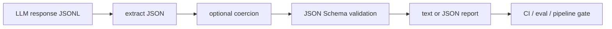

# llm-contract-guard

`llm-contract-guard` checks whether LLM responses actually match the JSON contract your
application expects. It is built for the awkward middle ground between prompting and production:
the model usually returns JSON, except when it wraps it in Markdown, adds a sentence, changes a
type, invents a field, or skips a required value.

## Why it is useful

Structured outputs are often treated as solved once a prompt says “return JSON”. In real
applications, failures still leak into queues, automations, dashboards, and API calls.
This tool gives you a small local gate for model output datasets, eval runs, CI fixtures, and
agent pipelines.

## Key Features

- extracts JSON objects or arrays from plain text, Markdown fences, and surrounding prose
- validates each record against JSON Schema Draft 2020-12
- reports exact failing paths such as `$.priority` or `$.items[0].score`
- supports JSONL batches with stable record IDs
- optionally coerces simple string numbers and booleans before validation
- returns non-zero exit codes for CI and automation
- exposes a small Python API for tests or pipeline checks

## Installation

```bash
python -m pip install -e ".[dev]"
```

For normal use without development tools:

```bash
python -m pip install .
```

## Usage

Validate a JSONL file of model outputs:

```bash
llm-contract-guard examples/model-outputs.jsonl \
  --schema examples/classifier.schema.json
```

Allow simple type coercion for responses like `"0.96"` and `"true"`:

```bash
llm-contract-guard examples/model-outputs.jsonl \
  --schema examples/classifier.schema.json \
  --coerce
```

Emit a machine-readable report:

```bash
llm-contract-guard examples/model-outputs.jsonl \
  --schema examples/classifier.schema.json \
  --format json
```

## CLI Options

```text
usage: llm-contract-guard [-h] --schema SCHEMA [--format {text,json}]
                          [--coerce] [--fail-fast]
                          input
```

- `input`: a `.jsonl` batch or a single text file containing one model response
- `--schema`: JSON Schema contract file
- `--format`: `text` for humans or `json` for automation
- `--coerce`: convert simple string numbers and booleans before validation
- `--fail-fast`: stop after the first invalid record

For JSONL input, each line can be a string or an object with one of these fields:
`output`, `response`, `content`, or `text`. If an `id` field is present, it appears in reports.

## Workflow



## Python API

```python
from llm_contract_guard import GuardConfig, validate_records

schema = {
    "type": "object",
    "required": ["label"],
    "properties": {"label": {"type": "string"}},
}

results = validate_records(
    [("sample-1", '{"label": "billing"}')],
    GuardConfig(schema=schema),
)

assert results[0].ok
```

## Tests

```bash
ruff check .
pytest
python -m llm_contract_guard --help
```

## License

MIT
